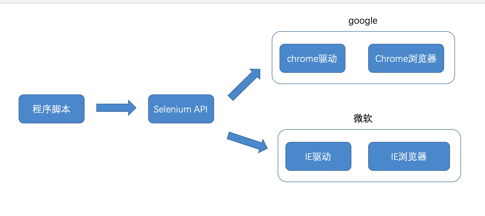
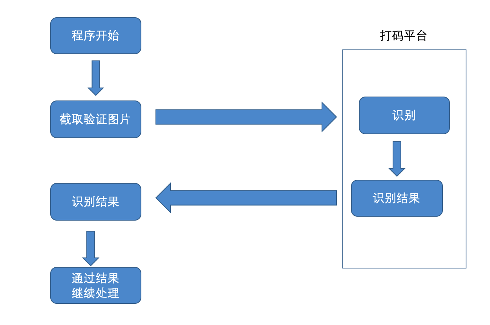
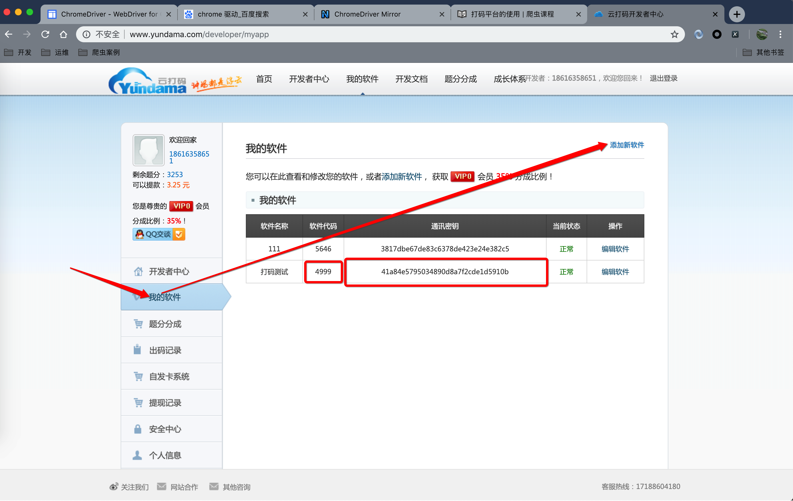

# 12306 自动登录下单

## 学习目标
> 通过 **Python** 程序能够实现自动登录下单功能。

## 预备知识

### selenium 模块

#### 介绍
> Selenium是一个Web的自动化测试工具，最初是为网站自动化测试而开发的，Selenium 可以直接运行在浏览器上，它支持所有主流的浏览器（包括PhantomJS这些无界面的浏览器），可以接收指令，让浏览器自动加载页面，获取需要的数据，甚至页面截屏。
>
> 程序脚本可以通过 Selenium API 控制浏览器。

#### 官方地址
[https://www.seleniumhq.org/](https://www.seleniumhq.org/)

#### 运行流程


#### 环境搭建与安装

##### 安装 Selenium 模块
```bash
pip install selenium
```

##### 下载对应的浏览器驱动
- chrome 驱动下载地址：[https://sites.google.com/a/chromium.org/chromedriver/](https://sites.google.com/a/chromium.org/chromedriver/)
- 国内淘宝镜像：[http://npm.taobao.org/mirrors/chromedriver/](http://npm.taobao.org/mirrors/chromedriver/)

>  **注意：**必须在下对应的 chrome 版本对应的驱动

#### 基本使用

##### 快速体验

```python
# 1. 导入模块
from selenium import webdriver

# 2. 创建浏览器对象
# 参数驱动路径
browser = webdriver.Chrome('./chromedriver')

# 3. 输入网址
browser.get("https://www.baidu.com/")

# 4. 操作浏览器
# 获取输入框元素
input_element = browser.find_element_by_id("kw")
# 输入内容
input_element.send_keys('itcast')

button_element = browser.find_element_by_id('su')
button_element.click()

time.sleep(1)

url_element = browser.find_element_by_class_name("favurl")
url_element.click()


time.sleep(5)

# 最后 退出浏览器
browser.quit()
```

##### 浏览器驱动寻找方式

1. 通过手动指定浏览器驱动路径
2. 通过 `$PATH`环境变量找寻浏览器驱动

##### 控制浏览器访问URL

```py
browser.get("https://www.baidu.com/") 
```

##### `find`系列函数定位元素

- `find_element_by_xxx` 返回第一个符合条件 `WebElement`
- `find_elements_by_xxx` 返回符合条件所有元素包含了`WebEelemnt`列表
- `find`函数系列说明
  - `find_element_by_class_name`    通过class 查询元素
  - `find_element_by_id`            通过 ID
  - `find_element_by_name`          通过name
  - `find_element_by_tag_name`      通过标签名称
  - `find_element_by_css_selector`  css样式选择
  - `find_element_by_link_text`     通过链接内容查找
  - `find_element_by_partial_link_text` 通过链接内容包含的内容查找，模糊查询
  - `find_element_by_xpath`         通过 xpath 查找数据
##### 获取元素属性和文本内容

```python
# 获取属性
element.get_attribute('属性名')
# 获取文本内容
element.text
```

##### 输入框输入内容

```python
input_element.send_keys('itcast')
```

##### 三种等待方式

当控制浏览器时，浏览器正在加载页面同时又去获取数据导致浏览器寻找不到需要操作的元素引发异常。

- 方式一：强制等待，浪费时间

  ```python
  time.sleep(秒数)
  ```

- 方式二：隐性等待，缺点：无法控制 AJAX请求

  ```python
  browser.implicitly_wait(等待时间)
  ```

- 方式三：显性等待，每个元素都可以自己定义检查条件

  - 手动编写方式

    ```python
    # 显性等待-手动编写
    t = time.time()
    # 定义超时时间
    timeout = 60
    while True:
        try:
            # 超时时间间隔
            time.sleep(0.1)
            url_element = browser.find_element_by_class_name("favurl")
            break
        except:
            # 超时处理
            if time.time() - t > timeout:
                break
            pass
    ```

  - 系统提供显性等待API

    ```python
    # 导入显性等待的API需要的模块
    # 1> 等待对象模块
    from selenium.webdriver.support.wait import WebDriverWait
    # 2> 导入等待条件模块
    from selenium.webdriver.support import expected_conditions as EC
    # 3> 导入查询元素模块
    from selenium.webdriver.common.by import By

    # 使用selenium api 实现显性等待
    # 1> 创建等待对象
    # 参数一 浏览器对象
    # 参数二 超时时间
    # 参数三 检查元素时间间隔
    wait = WebDriverWait(browser,60,0.1)
    # presence_of_element_located 检查元素是否存在，参数是一个元祖，元祖内部描述等待元素查询方案
    # visibility_of_element_located 检查元素是否可见
    url_element= wait.until(EC.presence_of_element_located((By.CLASS_NAME,"favurl")))
    ```


### 打码平台

#### 作用

可以通过第三方平台进行智能识别或者人工识别图片。

#### 流程



#### 优点

1. 价格便宜
2. 使用简单
3. 识别率高

#### 平台介绍

- 云打码 [http://www.yundama.com/](http://www.yundama.com/)
- 极验验证码智能识别辅助 [http://jiyandoc.c2567.com/](http://jiyandoc.c2567.com/)
- 超级鹰
- 打码兔
- 若快打码
- 等等

#### 基本使用

##### 后台创建软件



##### 在线测试

http://www.yundama.com/demo.html

##### 选择对应识别类型

http://www.yundama.com/price.html

##### 下载SDK

http://www.yundama.com/apidoc/YDM_SDK.html

##### 修改SDK集成项目

```python
import http.client, mimetypes, urllib, json, time, requests

######################################################################

class YDMHttp:

    apiurl = 'http://api.yundama.com/api.php'
    username = ''
    password = ''
    appid = ''
    appkey = ''

    def __init__(self, username, password, appid, appkey):
        self.username = username  
        self.password = password
        self.appid = str(appid)
        self.appkey = appkey

    def request(self, fields, files=[]):
        response = self.post_url(self.apiurl, fields, files)
        response = json.loads(response)
        return response
    
    def balance(self):
        data = {'method': 'balance', 'username': self.username, 'password': self.password, 'appid': self.appid, 'appkey': self.appkey}
        response = self.request(data)
        if (response):
            if (response['ret'] and response['ret'] < 0):
                return response['ret']
            else:
                return response['balance']
        else:
            return -9001
    
    def login(self):
        data = {'method': 'login', 'username': self.username, 'password': self.password, 'appid': self.appid, 'appkey': self.appkey}
        response = self.request(data)
        if (response):
            if (response['ret'] and response['ret'] < 0):
                return response['ret']
            else:
                return response['uid']
        else:
            return -9001

    def upload(self, filename, codetype, timeout):
        data = {'method': 'upload', 'username': self.username, 'password': self.password, 'appid': self.appid, 'appkey': self.appkey, 'codetype': str(codetype), 'timeout': str(timeout)}
        file = {'file': filename}
        response = self.request(data, file)
        if (response):
            if (response['ret'] and response['ret'] < 0):
                return response['ret']
            else:
                return response['cid']
        else:
            return -9001

    def result(self, cid):
        data = {'method': 'result', 'username': self.username, 'password': self.password, 'appid': self.appid, 'appkey': self.appkey, 'cid': str(cid)}
        response = self.request(data)
        return response and response['text'] or ''

    def decode(self, filename, codetype, timeout):
        cid = self.upload(filename, codetype, timeout)
        if (cid > 0):
            for i in range(0, timeout):
                result = self.result(cid)
                if (result != ''):
                    return cid, result
                else:
                    time.sleep(1)
            return -3003, ''
        else:
            return cid, ''

    def report(self, cid):
        data = {'method': 'report', 'username': self.username, 'password': self.password, 'appid': self.appid, 'appkey': self.appkey, 'cid': str(cid), 'flag': '0'}
        response = self.request(data)
        if (response):
            return response['ret']
        else:
            return -9001

    def post_url(self, url, fields, files=[]):
        for key in files:
            files[key] = open(files[key], 'rb');
        res = requests.post(url, files=files, data=fields)
        return res.text

######################################################################

# 用户名
username    = '18616358651'

# 密码
password    = 'qwer1234'

# 软件ＩＤ，开发者分成必要参数。登录开发者后台【我的软件】获得！
appid       = 4999

# 软件密钥，开发者分成必要参数。登录开发者后台【我的软件】获得！
appkey      = '41a84e5795034890d8a7f2cde1d5910b'


def decode(filename,codetype=3000):
    # 图片文件
    # filename    = 'test.png'

    # 验证码类型，# 例：1004表示4位字母数字，不同类型收费不同。请准确填写，否则影响识别率。在此查询所有类型 http://www.yundama.com/price.html
    codetype    = 3000

    # 超时时间，秒
    timeout     = 60

    # 检查
    if (username == 'username'):
        print('请设置好相关参数再测试')
    else:
        # 初始化
        yundama = YDMHttp(username, password, appid, appkey)

        # 登陆云打码
        uid = yundama.login();
        print('uid: %s' % uid)

        # 查询余额
        balance = yundama.balance();
        print('balance: %s' % balance)

        # 开始识别，图片路径，验证码类型ID，超时时间（秒），识别结果
        cid, result = yundama.decode(filename, codetype, timeout);
        print('cid: %s, result: %s' % (cid, result))
        return result

######################################################################

```

##### 识别 12306 登录验证码

```python
#!/usr/bin/python3
# -*- coding: utf-8 -*-
from YDMHTTP import decode
print(decode('./test_pics/test.jpg',codetype=6701))
```

## 12306 抢票实战

### 分析购票流程


### 实现步骤

1. 访问列表页
2. 通过时间判定选择点击预订
3. 点击账号登录
4. 输入用户名和密码
5. 截图获取验证码图片
6. 发送打码平台获取识别数字
7. 定义8个点击坐标
8. 模拟点击坐标
9. 点击登录
10. 点击选择人物
11. 点击提交订单
12. 点击确认订单

### 代码实现

#### 访问列表页 

```python
# 访问列表页
fs = "上海,SHH"
ts = "北京,BJP"
date = "2019-01-11"
url = "https://kyfw.12306.cn/otn/leftTicket/init?linktypeid=dc&fs={}&ts={}&date={}&flag=N,N,Y"
browser.get(url.format(fs,ts,date))
```

#### 通过时间判定选择点击预订

```python
# 获取 tr 列表
tr_list = wait.until(EC.visibility_of_all_elements_located((By.CLASS_NAME,'bgc')))
for tr in tr_list:
    start_time = tr.find_element_by_class_name('start-t').text
    # 内部可以判定出发时间
    tr.find_element_by_class_name('btn72').click()
    break
```

####  点击账号

```python
account_login_element = wait.until(EC.presence_of_element_located((By.LINK_TEXT,'账号登录')))
account_login_element.click()
```

#### 输入用户名和密码

```python
browser.find_element_by_id('J-userName').send_keys(username)
browser.find_element_by_id('J-password').send_keys(pwd)
```

#### 截取验证码图片

> **注意：**
>
> 1.  需要安装图片操作库 `pip install Pillow`
> 2.  在 Mac 平台下如果是 retina 屏幕，屏幕上的一个点相当于 2 个像素

```python
scale = 2
login_img_element = wait.until(EC.visibility_of_element_located((By.ID,'J-loginImg')))
full_img_data = browser.get_screenshot_as_png()
full_img = Image.open(BytesIO(full_img_data))
x1 = login_img_element.location["x"] * 2
y1 = login_img_element.location["y"] * 2
x2 = x1 + login_img_element.size["width"] * 2
y2 = y1 + login_img_element.size["height"] * 2
cut_info = (x1,y1,x2,y2)
cut_img = full_img.crop(cut_info)
cut_img.save('cut_img.png')
```

#### 发送打码平台获取数字

```python
result = decode('cut_img.png',6701)
```

#### 定义8个点击坐标点

```python
positions = [
    (80,140),
    (230,140),
    (380,140),
    (530,140),
    (80, 280),
    (230, 280),
    (380, 280),
    (530, 280)
]
```

#### 模拟点击坐标

```python
for num in result:
    position = positions[int(num) - 1]
    # 模拟点击
    ActionChains(browser).move_to_element_with_offset(login_img_element,position[0] / scale,position[1] / scale).click().perform()
```

#### 点击登录

```python
browser.find_element_by_link_text('立即登录').click()
```

#### 点击选择人物

```python
wait.until(EC.visibility_of_element_located((By.ID,'normalPassenger_0'))).click()
```

#### 点击提交订单

```python
browser.find_element_by_id('submitOrder_id').click()
```

#### 点击确认订单

```python
wait.until(EC.visibility_of_element_located((By.ID,'qr_submit_id'))).click()
```

### 最终代码

```python
#!/usr/bin/python3
# -*- coding: utf-8 -*-

import json
from selenium import webdriver

# 导入图片库 【注意】需要安装库: pip install Pillow
from PIL import Image
from io import BytesIO

import time
from YDMHTTP import decode

from selenium.webdriver import ActionChains
from selenium.webdriver.support.ui import WebDriverWait
from selenium.webdriver.support import expected_conditions as EC
from selenium.webdriver.common.by import By

browser = webdriver.Chrome('./chromedriver')
wait = WebDriverWait(browser,10,0.5)

with open('account.json','r',encoding='utf-8') as f:
    account = json.load(f)

username = account["username"]
pwd = account["pwd"]

# 访问列表页
fs = "上海,SHH"
ts = "北京,BJP"
date = "2019-01-11"
url = "https://kyfw.12306.cn/otn/leftTicket/init?linktypeid=dc&fs={}&ts={}&date={}&flag=N,N,Y"
browser.get(url.format(fs,ts,date))

# 获取 tr 列表
tr_list = wait.until(EC.visibility_of_all_elements_located((By.CLASS_NAME,'bgc')))
for tr in tr_list:
    start_time = tr.find_element_by_class_name('start-t').text
    # 内部可以判定出发时间
    tr.find_element_by_class_name('btn72').click()
    break

# 点击账号
account_login_element = wait.until(EC.presence_of_element_located((By.LINK_TEXT,'账号登录')))
account_login_element.click()

# 输入用户名和密码
browser.find_element_by_id('J-userName').send_keys(username)
browser.find_element_by_id('J-password').send_keys(pwd)

# 截取验证码图片
scale = 2
login_img_element = wait.until(EC.visibility_of_element_located((By.ID,'J-loginImg')))
full_img_data = browser.get_screenshot_as_png()
full_img = Image.open(BytesIO(full_img_data))
x1 = login_img_element.location["x"] * 2
y1 = login_img_element.location["y"] * 2
x2 = x1 + login_img_element.size["width"] * 2
y2 = y1 + login_img_element.size["height"] * 2
cut_info = (x1,y1,x2,y2)
cut_img = full_img.crop(cut_info)
cut_img.save('cut_img.png')

# 发送打码平台获取数字
result = decode('cut_img.png',6701)
# 定义8个坐标点
positions = [
    (80,140),
    (230,140),
    (380,140),
    (530,140),
    (80, 280),
    (230, 280),
    (380, 280),
    (530, 280)
]
for num in result:
    position = positions[int(num) - 1]
    # 模拟点击
    ActionChains(browser).move_to_element_with_offset(login_img_element,position[0] / scale,position[1] / scale).click().perform()

# 点击登录
browser.find_element_by_link_text('立即登录').click()

# 点击选择人物
wait.until(EC.visibility_of_element_located((By.ID,'normalPassenger_0'))).click()

# 点击提交订单
browser.find_element_by_id('submitOrder_id').click()

# 点击确认订单
wait.until(EC.visibility_of_element_located((By.ID,'qr_submit_id'))).click()

time.sleep(10)
browser.quit()
```